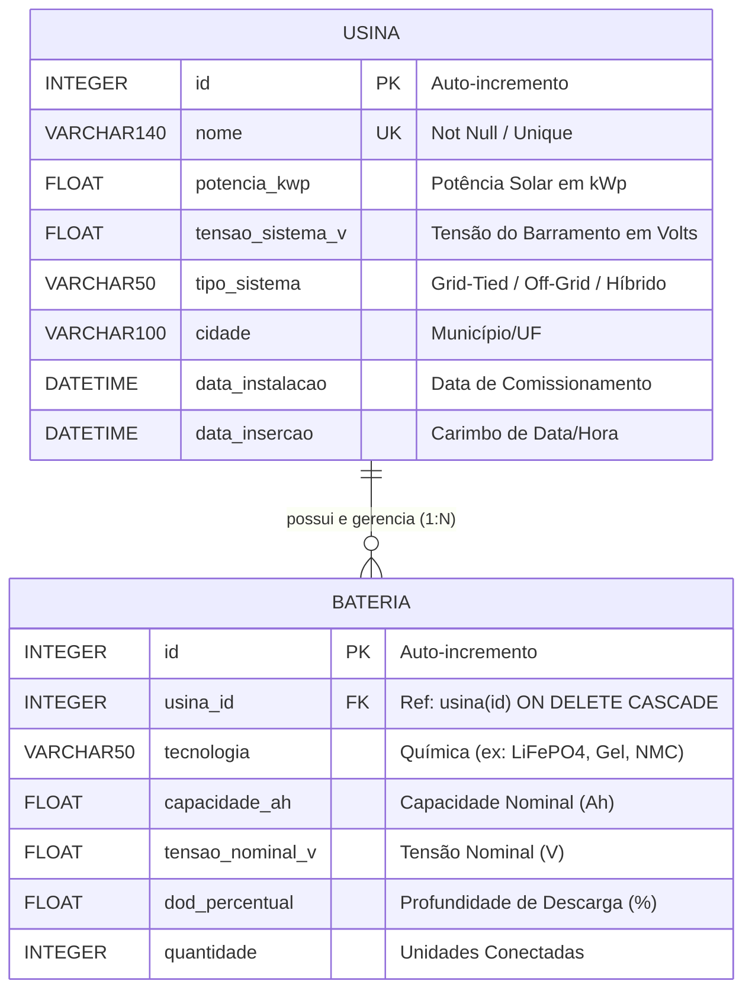

# ⚡ SolarStorage API — RESTful Backend Service

API RESTful de alta performance desenvolvida em Python 3 com Flask, SQLAlchemy e Pydantic para gestão cadastral, monitoramento e dimensionamento elétrico de **Usinas Fotovoltaicas** e **Bancos de Baterias (Battery Energy Storage Systems - BESS)**.

O serviço calcula automaticamente a capacidade útil de energia armazenada em $kWh$ com base na profundidade de descarga ($\text{DoD } \%$), tensão e capacidade nominal dos módulos.

---

## 🚀 Tecnologias Utilizadas

* **Python 3.10+**
* **Flask 3.0+** — Framework web micro.
* **Flask-OpenAPI3** — Gerador automático de documentação Swagger/RapiDoc.
* **SQLAlchemy 2.0+** — ORM relacional com mapeamento $1:N$ e deleção em cascata.
* **Pydantic 2.0+** — Validação e serialização rigorosa dos DTOs/JSONs.
* **Flask-CORS** — Habilitação de requisições Cross-Origin para o front-end.

---

## 🏛️ Arquitetura do Projeto & Estrutura de Arquivos

O serviço segue o padrão **MVC (Model-View-Controller)** com separação estrita de camadas e responsabilidades:

```text
solarstorage-api/
├── controllers/          # Camada de Controle (Rotas REST & Regras de Negócio)
│   ├── usina_controller.py    # Rotas CRUD de Usinas Fotovoltaicas
│   └── bateria_controller.py  # Rotas CRUD e vínculo de Baterias BESS
├── model/                # Camada de Dados (ORM / SQLAlchemy & SQLite)
│   ├── base.py                # Inicialização do SQLAlchemy e DeclarativeBase
│   ├── usina.py               # Mapeamento ORM da tabela USINA (1:N com Bateria)
│   └── bateria.py             # Mapeamento ORM da tabela BATERIA (FK usina_id)
├── schemas/              # DTOs, Validações Pydantic v2 & OpenAPI
│   ├── usina.py               # DTOs da Usina, busca/edição e cálculo de kWh útil
│   ├── bateria.py             # DTOs de cadastro e atualização de Baterias
│   └── error.py               # Schema de respostas de erro padronizadas (400, 404, 409)
├── database/             # Diretório de persistência do banco (db.sqlite3)
├── app.py                # Ponto de entrada Flask-OpenAPI3 e registro de rotas
└── requirements.txt      # Gerenciador de dependências Python
```

### 📂 Detalhamento das Camadas do Back-End

* **`controllers/` (Controladores REST):**
  * **`usina_controller.py`:** Define e registra as rotas de criação, busca, atualização e remoção de usinas, aplicando validações de unicidade de nome e gerenciando transações de banco (`commit`/`rollback`).
  * **`bateria_controller.py`:** Controla as operações de adição, edição e exclusão de bancos BESS vinculados a uma usina pai.
* **`model/` (Mapeamento de Dados / ORM):**
  * **`base.py`:** Define a classe base abstrata do SQLAlchemy para criação e integração das tabelas no SQLite.
  * **`usina.py`:** Entidade relacional que mapeia a usina solar, estabelecendo a relação de 1 para N (`relationship`) e deleção em cascata (`cascade="all, delete-orphan"`) com o banco de baterias.
  * **`bateria.py`:** Entidade relacional contendo os parâmetros elétricos dos módulos ($Ah$, $V$, $\text{DoD } \%$ e quantidade) e a chave estrangeira `usina_id`.
* **`schemas/` (Validação DTO & Swagger):**
  * **`usina.py`:** Contém os schemas Pydantic de entrada/saída (`UsinaSchema`, `UsinaViewSchema`, etc.) e a função serializadora `apresenta_usina()`, responsável pelo cálculo matemático dinâmico da energia armazenada em $kWh$.
  * **`bateria.py`:** Contém os schemas para sanitização dos dados dos módulos BESS (`BateriaSchema`, `BateriaAtualizaSchema`, etc.).
  * **`error.py`:** Schema de mensagens de erro estruturadas (`ErrorSchema`) para retorno nos endpoints HTTP.

---

## 🛢️ Modelagem do Banco de Dados & DER

O banco de dados relacional **SQLite 3** é gerenciado pelo ORM **SQLAlchemy 2.0**.



---

## 📋 Detalhamento dos Parâmetros de Cadastro

### 1. Entidade Usina Solar (`USINA`)

* **`nome` (String / Obrigatório / Único):** Identificador textual da usina (ex: `"Usina Sol Nascente"`). A API valida a unicidade rejeitando duplicidades com código `409 Conflict`.
* **`potencia_kwp` (Float / Obrigatório):** Potência nominal total do arranjo de painéis solares em **Quilowatt-pico ($kWp$)**.
* **`tensao_sistema_v` (Float / Obrigatório):** Tensão elétrica do barramento em **Volts ($V$)** (ex: $48\text{ V}$, $220\text{ V}$, $380\text{ V}$). Serve como valor de *fallback* técnico para o cálculo caso a bateria não informe tensão nominal individual.
* **`tipo_sistema` (String / Obrigatório):** Topologia do sistema (`Grid-Tied (On-Grid)`, `Off-Grid` ou `Híbrido (Backup + Grid)`).
* **`cidade` (String / Obrigatório):** Localização geográfica cadastrada no padrão `"Município/UF"` (ex: `"Santa Isabel/SP"`).
* **`data_instalacao` (Date / Obrigatório):** Data de comissionamento/entrada em operação comercial.

### 2. Entidade Banco de Baterias (`BATERIA`)

* **`usina_id` (Integer / Foreign Key / Obrigatório):** ID da usina pai à qual o banco BESS está vinculado.
* **`tecnologia` (String / Obrigatório):** Química das células (ex: `LiFePO4`, `Chumbo-Ácido`, `Gel`, `NMC`, `LTO`).
* **`capacidade_ah` (Float / Obrigatório):** Capacidade de carga nominal de um módulo individual em **Ampère-hora ($Ah$)**.
* **`tensao_nominal_v` (Float / Obrigatório):** Tensão individual do módulo em **Volts ($V$)**.
* **`dod_percentual` (Float / Obrigatório):** Profundidade de descarga (**Depth of Discharge - DoD %**). Percentual seguro de utilização da capacidade (ex: $80\%$ para Lítio, $50\%$ para Chumbo-Ácido).
* **`quantidade` (Integer / Obrigatório):** Número de módulos idênticos associados no banco.

---

## 🧮 Detalhamento do Cálculo de Capacidade Útil ($kWh$)

A energia armazenada real e útil que um banco BESS pode fornecer é calculada pela equação:

$$\text{Capacidade Útil (kWh)} = \frac{\text{Capacidade (Ah)} \times \text{Tensão Nominal (V)} \times \left(\frac{\text{DoD \%}}{100}\right) \times \text{Quantidade}}{1000}$$

### 🔍 Explicação dos Componentes:
1. **Capacidade ($Ah$):** Mede a quantidade de carga elétrica contida no módulo.
2. **Tensão Nominal ($V$):** Converte a capacidade de carga pura em energia de trabalho em Watt-hora ($Wh = Ah \times V$).
3. **Profundidade de Descarga ($\text{DoD \%}$):** Aplica a margem de segurança técnica para preservar a vida útil da bateria ($\frac{\text{DoD}}{100}$).
4. **Quantidade ($Q$):** Multiplica a capacidade unitária pelo total de módulos do banco.
5. **Divisor $1000$:** Converte a unidade de Watt-hora ($Wh$) para Quilowatt-hora ($kWh$).

### 📊 Exemplo Prático:
Para um banco com **5 baterias de Lítio (LiFePO4)** ($100\text{ Ah}$, $48\text{ V}$, $\text{DoD } 80\%$):

$$\text{Capacidade Útil (kWh)} = \frac{100 \times 48 \times \left(\frac{80}{100}\right) \times 5}{1000} = \frac{4800 \times 0.80 \times 5}{1000} = 19.20\text{ kWh}$$

---

## 🧪 Endpoints da API (Resumo RESTful)

| Categoria | Método | Rota | Descrição | Status Esperados |
| :--- | :---: | :--- | :--- | :--- |
| **Usina** | `GET` | `/usinas` | Retorna todas as usinas e seus bancos BESS | `200 OK` |
| **Usina** | `GET` | `/usina?id={id}` | Busca os dados detalhados de uma usina específica por ID | `200 OK`, `404 Not Found` |
| **Usina** | `POST` | `/usina` | Cadastra uma nova usina fotovoltaica | `200 OK`, `400 Bad Request`, `409 Conflict` |
| **Usina** | `PUT` | `/usina?id={id}` | Atualiza dados cadastrais de uma usina existente | `200 OK`, `400 Bad Request`, `404`, `409` |
| **Usina** | `DELETE` | `/usina?id={id}` | Remove uma usina (deleção em cascata) | `200 OK`, `404 Not Found` |
| **Bateria** | `POST` | `/bateria` | Adiciona um banco de baterias a uma usina | `200 OK`, `400 Bad Request`, `404` |
| **Bateria** | `PUT` | `/bateria?id={id}` | Atualiza especificações técnicas da bateria | `200 OK`, `400 Bad Request`, `404` |
| **Bateria** | `DELETE` | `/bateria?id={id}` | Exclui um banco de baterias individual | `200 OK`, `404 Not Found` |

---

## ⚙️ Como Executar o Back-End Localmente

### 1. Clonar o Repositório
```bash
git clone https://github.com/seu-usuario/solarstorage-api.git
cd solarstorage-api
```

### 2. Criar e Ativar o Ambiente Virtual (`venv`)
- **Windows (PowerShell / CMD):**
  ```powershell
  python -m venv env
  .\env\Scripts\activate
  ```
- **Linux / macOS:**
  ```bash
  python3 -m venv env
  source env/bin/activate
  ```

### 3. Instalar Dependências
```bash
pip install -r requirements.txt
```

### 4. Executar a Aplicação
```bash
python app.py
```
O servidor estará acessível em `http://127.0.0.1:5000`.

---

## 📑 Documentação Interativa (OpenAPI 3 / Swagger)

Com a API em execução, acesse no navegador:
* **Swagger UI:** [http://127.0.0.1:5000/openapi/swagger](http://127.0.0.1:5000/openapi/swagger)
* **RapiDoc:** [http://127.0.0.1:5000/openapi/rapidoc](http://127.0.0.1:5000/openapi/rapidoc)
* **Especificação JSON OpenAPI:** [http://127.0.0.1:5000/openapi/openapi.json](http://127.0.0.1:5000/openapi/openapi.json)

---
